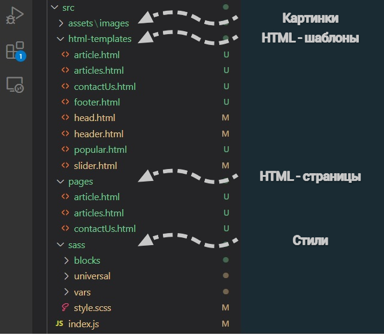

<h1 align="center">Многостраничный сайт</h1>

_**[Развёрнуто здесь](https://djess-v.github.io/otus--homework--09/)**_

---

<h2>Визуальное представление</h2>

<h2>Функционал блога</h2>

Работают три ссылки верхнего меню: Home, Articles и Contact Us. Также, если нажать на странице - .../articles.html на карточку статьи, то будет осуществлён переход на страницу статьи - .../article.html.

На странице, в блоке - "header" подключен слайдер.

<h2>Структура проекта</h2>

